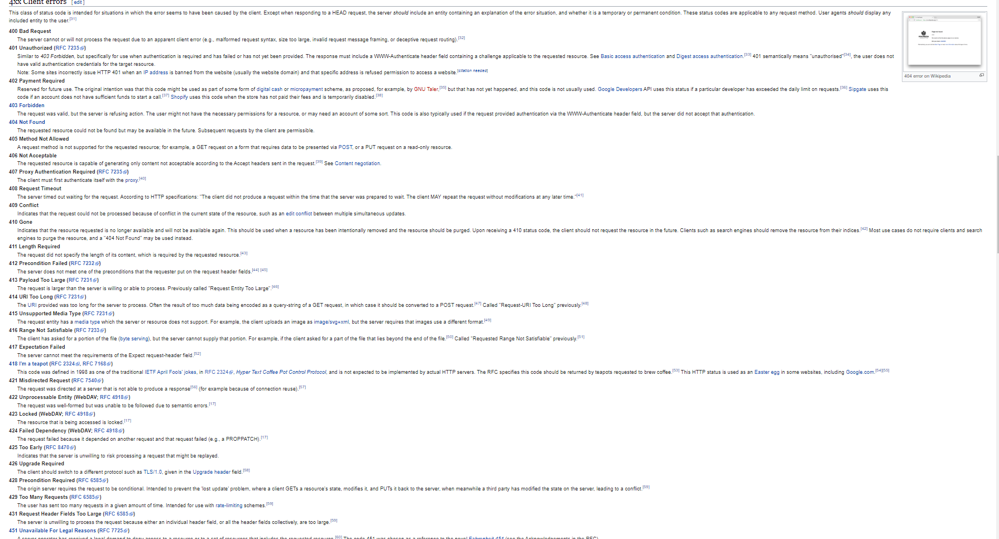

# LAB5-CVDS

> ## Integrantes
> 
> - Andres Rocha
> - David Herrera 

> ## ¿Qué codigo de error sale?
>
> Sale el error **400 Bad Request**
>
> ## ¿Qué otros códigos de error existen?, ¿En qué caso se manejarán?

> ## ¿Cuál es la diferencia entre los verbos GET y POST? ¿Qué otros tipos de peticiones existen?
>
> La diferencia entre los métodos get y post radica en la forma de enviar los datos a la página cuando se pulsa el botón “Enviar”. Mientras que el método GET envía los datos usando la URL, el método POST los envía de forma que no podemos verlos (en un segundo plano u "ocultos" al usuario).
> - Get
> - Options
> - Head
> - Put
> - Post
> - Delete
> - Connect
> - Trace

> ## ¿Cuáles son las diferencias con los diferentes parámetros?
> 
> **-i** muestra solo informacion del documento
>
> **-V** muestra la version

 